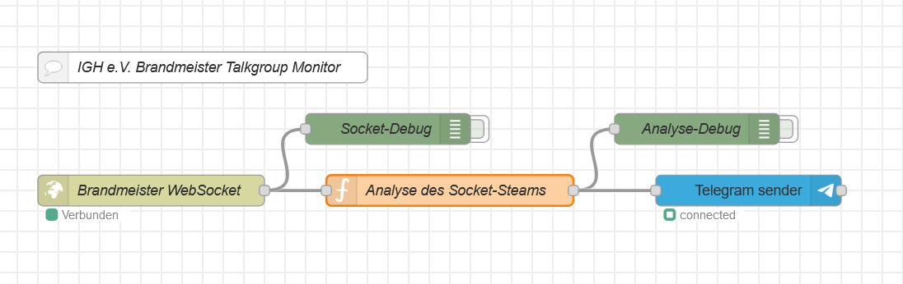

# Node-RED Flow: DMR Talkgroup Monitoring and Telegram Notification

## Beschreibung

Dieser Node-RED-Flow überwacht eine spezifische DMR-Talkgroup (in diesem Beispiel die Talkgroup mit der ID `2627`). Der Flow filtert eingehende Nachrichten basierend auf verschiedenen Kriterien, formatiert die relevanten Informationen und sendet sie dann als Telegram-Nachricht an einen angegebenen Telegram-Channel oder eine Gruppe. Der Flow verwendet einen Cooldown-Mechanismus, um zu verhindern, dass wiederholte Nachrichten innerhalb von 5 Minuten gesendet werden.

### Hauptfunktionen

1. **DMR-Talkgroup-Überwachung**: Der Flow überwacht eine bestimmte DMR-Talkgroup auf eingehende Nachrichten.
2. **Filterung nach Rufzeichen**: Nachrichten ohne Rufzeichen (`SourceCall`) werden ignoriert.
3. **Cooldown-Mechanismus**: Es wird sichergestellt, dass für jede User ID (`SourceID`) nur einmal alle 5 Minuten eine Nachricht gesendet wird, um Spam zu vermeiden.
4. **Nachrichtenformatierung**: Die empfangenen Daten werden in einem benutzerdefinierten Format strukturiert und formatiert, um die Lesbarkeit zu verbessern.
5. **Telegram-Benachrichtigung**: Die formatierte Nachricht wird an einen konfigurierten Telegram-Channel oder eine Gruppe gesendet.

## Funktionsweise

1. **Eingehende DMR-Daten**: Der Flow empfängt DMR-Daten von einer spezifischen Talkgroup. Die Daten enthalten Informationen wie Rufzeichen (`SourceCall`), User ID (`SourceID`), Name (`SourceName`), RSSI, HotSpot (`LinkName`), und Talker Alias (`TalkerAlias`).

2. **Filterung der Nachrichten**:
   - Nachrichten ohne Rufzeichen werden sofort ignoriert.
   - Der Flow überprüft, ob die Nachricht von der überwachten Talkgroup stammt.

3. **Cooldown-Mechanismus**:
   - Für jede User ID (`SourceID`) wird ein Zeitstempel gespeichert.
   - Wenn innerhalb der letzten 5 Minuten bereits eine Nachricht von derselben User ID gesendet wurde, wird die neue Nachricht ignoriert.
   
4. **Nachrichtenformatierung**:
   - **Erste Zeile**: Zeigt das Rufzeichen als klickbaren Link an. Der Name wird fett formatiert und als "Unbekannt" angezeigt, wenn kein Name vorhanden ist. Die User ID wird in Klammern angezeigt, ebenfalls als klickbarer Link.
   - **Zweite Zeile**: RSSI und HotSpot werden nebeneinander angezeigt, jeweils mit einem Sendesignal-Icon (`📡`).
   - **Dritte Zeile**: Der Talker Alias wird fett formatiert und mit einem Info-Symbol (`ℹ️`) angezeigt.

5. **Telegram-Benachrichtigung**:
   - Die formatierte Nachricht wird an den angegebenen Telegram-Channel oder die Gruppe gesendet.
   - Die Nachricht wird im Markdown-Format gesendet, um sicherzustellen, dass Links klickbar und Textformatierungen korrekt sind.

## Voraussetzungen

- **Node-RED**: Dieser Flow läuft auf einer Node-RED-Instanz.
- **Telegram Bot**: Ein Telegram-Bot muss erstellt und konfiguriert werden, um Nachrichten an den gewünschten Channel oder die Gruppe zu senden. Der Bot-Token muss in der Telegram Node in Node-RED konfiguriert sein.

## Konfiguration

1. **Telegram Output Node**: Konfiguriere den Telegram Output Node in Node-RED mit dem Bot-Token und der Ziel-Chat-ID oder dem Channel-Benutzernamen (`chatId`).
2. **Talkgroup ID**: Stelle sicher, dass die `targetTalkgroupID` im Function Node auf die richtige Talkgroup-ID gesetzt ist, die du überwachen möchtest.
3. **Chat-ID oder Channel-Benutzername**: Ändere `chatId: '@TG264555'` im Function Node auf den tatsächlichen Channel-Benutzernamen oder die Gruppe, an die die Nachricht gesendet werden soll.

## Infos
Dieser Flow wurde im Rahmen der Aktivitäten von [https://www.ighamspirit.de/ IG Hamspirit e.V.] entwickelt, einem engagierten Amateurfunkverein, der sich der Förderung des Amateurfunks und der Unterstützung seiner Mitglieder widmet. 

73!
Denis Apel, DO7TC
